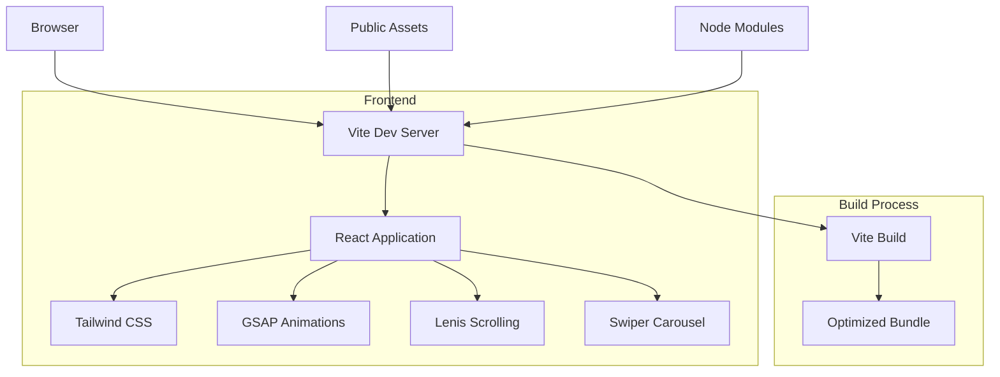
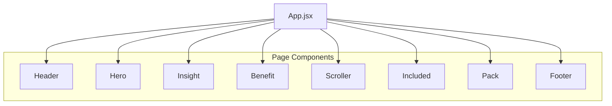
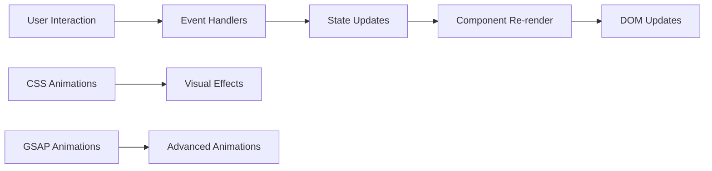

# Design2Code - Hackathon Event Website


A modern, responsive website for a 48-hour hackathon event built with React, Vite, and Tailwind CSS. Features smooth animations with GSAP and Lenis scrolling for an enhanced user experience.

## 📋 Table of Contents

- [Features](#features)
- [Architecture](#architecture)
- [Tech Stack](#tech-stack)
- [Prerequisites](#prerequisites)
- [Installation](#installation)
- [Available Scripts](#available-scripts)
- [Project Structure](#project-structure)
- [Components](#components)
- [Contributing](#contributing)
- [License](#license)

## ✨ Features

| Feature | Description |
|--------|-------------|
| **Responsive Design** | Fully responsive layout that works on mobile, tablet, and desktop devices |
| **Smooth Animations** | GSAP-powered animations for engaging user interactions |
| **Smooth Scrolling** | Lenis integration for buttery-smooth scrolling experience |
| **Modern UI** | Clean, contemporary design with Tailwind CSS styling |
| **Component-Based Architecture** | Reusable, modular components for easy maintenance |

## 🏗️ Architecture

### System Diagram



### Component Architecture



### Data Flow



## 💻 Tech Stack

| Technology | Version | Purpose |
|------------|---------|---------|
| [React](https://reactjs.org/) | 19.0.0 | Core UI library |
| [Vite](https://vitejs.dev/) | 6.1.0 | Build tool and development server |
| [Tailwind CSS](https://tailwindcss.com/) | 4.1.11 | Utility-first CSS framework |
| [GSAP](https://greensock.com/gsap/) | 3.13.0 | Animation library |
| [Lenis](https://lenis.studiofreight.com/) | 1.3.15 | Smooth scrolling |
| [Swiper](https://swiperjs.com/) | 11.2.10 | Touch-enabled carousel/slider |

## 📋 Prerequisites

- Node.js >= 16.x
- npm >= 8.x

## ⚙️ Installation

1. Clone the repository:
   ```bash
   git clone <repository-url>
   ```

2. Navigate to the project directory:
   ```bash
   cd UX-Club
   ```

3. Install dependencies:
   ```bash
   npm install
   ```

## ▶️ Available Scripts

| Script | Description |
|--------|-------------|
| `npm run dev` | Starts the development server |
| `npm run build` | Builds the production-ready application |
| `npm run lint` | Runs ESLint to check for code issues |
| `npm run preview` | Previews the production build locally |

## 📁 Project Structure

```
UX-Club/
├── src/
│   ├── components/
│   │   ├── Benefit.jsx
│   │   ├── Footer.jsx
│   │   ├── Header.jsx
│   │   ├── Hero.jsx
│   │   ├── Included.jsx
│   │   ├── Insight.jsx
│   │   ├── Pack.jsx
│   │   ├── Scroller.jsx
│   │   └── Testimonials.jsx
│   ├── App.jsx
│   ├── index.css
│   └── main.jsx
├── public/
├── index.html
├── package.json
├── vite.config.js
└── README.md
```

## 🧩 Components

| Component | Description |
|-----------|-------------|
| [Header](./src/components/Header.jsx) | Navigation bar with logo and menu items |
| [Hero](./src/components/Hero.jsx) | Main landing section with call-to-action buttons |
| [Insight](./src/components/Insight.jsx) | Event insights and information section |
| [Benefit](./src/components/Benefit.jsx) | Benefits of participating in the hackathon |
| [Scroller](./src/components/Scroller.jsx) | Horizontal scrolling content section |
| [Included](./src/components/Included.jsx) | What's included in the event |
| [Pack](./src/components/Pack.jsx) | Event packages and offerings |
| [Footer](./src/components/Footer.jsx) | Footer with contact information and links |

## 🤝 Contributing

1. Fork the repository
2. Create your feature branch (`git checkout -b feature/AmazingFeature`)
3. Commit your changes (`git commit -m 'Add some AmazingFeature'`)
4. Push to the branch (`git push origin feature/AmazingFeature`)
5. Open a pull request

## 📄 License

This project is licensed under the MIT License - see the [LICENSE](LICENSE) file for details.